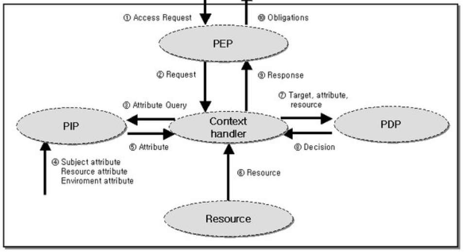
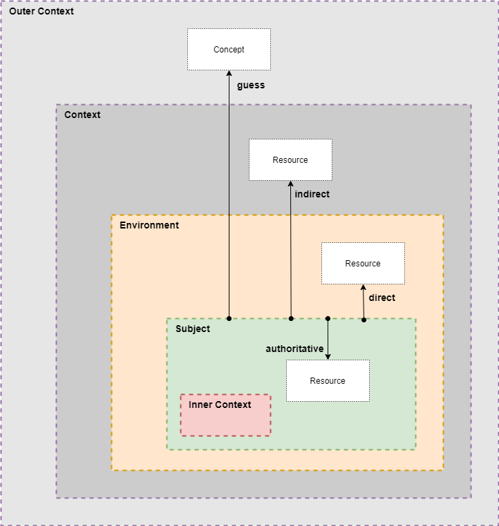

# Policy Information Point (**PIP**, v2)

> > > **CAUTION**
>
> - current status is something like a **draft** or starting point for **discussion**
> - current text is sometimes redundant and will be condensed by further work
> - all definitions sometimes are a *little* underspecified* :-(
> - all specification might contain *bugs*, that will be eliminated in future :-)
> - ...hopefully being a good starting point
> - so far **NOT** usable for production!
>
> > > **CAUTION**

> > > **CHANGES (2023-08-08) to last contribution**

> > > **CHANGES to last contribution**

## Editors

- Jörg Langkau (nicos AG}

## Abstract

This document describes the architecture of a *Policy Information Point* (**PIP**, as concept) and given *PIP Data Model* [**PIP-DM**].

## Table of Content

- [Prologue](#prologue)
- [The P-Family](#the-p-family)
- [Introduction of data-typed Information](#introduction-of-data-typed-information)
- [Request for Information](#request-for-information)
- [Introducing `pip:Information`-Request](#introducing-pipinformation--request)
- [Implementation / Binding](#implementation--binding)
- [Request, Cache and Subscription](#request-cache-and-subscription)

*Table of content 'Policy Information Point'*.

## Prologue

The **PIP**, literally speaking:

> A *Policy*, computed by an agent, the Policy Decision Point (**PDP**), needs some
*Information* as input to given constraints (utilized by given rules) and gets it, the *Information* from a
*Point*, the Policy Information Point (**PIP**).

## The P-Family



Two categories of **PIP**s can be identified:

### internal PIP

The PDP has direct access to given information, like 'current time'.

### external PIP

The PDP has indirect access to given information. So the decision utilises an external endpoint as a service. This service behaves as a Data Provider.

### Subject and Context



*Coming from [here](https://github.com/nicosResearchAndDevelopment/LDS/tree/main/misc/context).*

## Introduction of data-typed Information

The data-typed information (subjects *attribute* or *property*) is needed to be compared by binary operators:

Example: A constraint, expressed in ODRL. This expression will be computed (by PDP) without *external* information provided, all information is nested in given *inner context* - and leads to `"true"`.

```json
{
	"@type": "odrl:Constraint",
	"odrl:leftOperand": { "@type": "xsd:decimal", "@value": "42.0" },
	"odrl:operator": "odrl:gt",
	"odrl:rightOperand": { "@type": "xsd:decimal", "@value": "36.5" },
	"odrl:dataType": "xsd:decimal"
}
```
> POINT TO: `odrl:dataType` is *ruled* by rightOperands `@type`! 

Example: A constraint, expressed in ODRL. This expression uses the [`odrl:rightOperandReference`](https://www.w3.org/TR/odrl-vocab/#term-rightOperandReference).

> "A reference to a web resource providing the value for the right operand of a Constraint."

and

> "An IRI that MUST be dereferenced to obtain the actual right operand value."

```json
{
	"@type": "odrl:Constraint",
	"odrl:leftOperand": { "@type": "xsd:decimal", "@value": "42.0" },
	"odrl:operator": "odrl:gt",
	"odrl:rightOperandReference": { "@type": "xsd:anyURI", "@value": "https://www.example.com/weather/station/muenster/temperature" },
	"odrl:dataType": "xsd:decimal",
	"odrl:unit": "http://qudt.org/vocab/unit/DEG_C"
}
```
> POINT TO: `odrl:unit`!


...shortcut 

```json
{
	"odrl:rightOperandReference": "https://www.example.com/weather/station/muenster/temperature"
}
```

---

## Request for Information

Request of Information from given Information Point **PIP**.

> data-typed *Attribute*, *Property*.
> 
> >NOT
> 
> *Resource*

Example: **PDP** (or better: given **context handler**) de-references an URI that is *hopefully* an URL:

```json
{
	"odrl:rightOperandReference": "https://www.nicos-ag.com/weather/station/muenster/temperature"
}
```

http request:
```http request
GET https://www.nicos-ag.com/weather/station/muenster/temperature
```
...response
```text
36
```

## Introducing `pip:Information`-Request

POST wins, because of better *parametrization*:

### 1. Request: the temperature from given Weather-station:

http request:

```http request
POST https://www.nicos-ag.com/weather/station/muenster/temperature

{
	"@context": https://github.com/nicosResearchAndDevelopment/pip/tree/main/v2/
	"@id": "https://www.example-2.com/request/1243-124-1234-1234-1234",
	"@type": "pip:InformationRequest",
	"pip:expectedType": [ "xsd:decimal", "xsd:integer" ],
	"pip:expectedUnit": "http://qudt.org/vocab/unit/DEG_C"
}
```
> POINT TO: `pip:expectedType``as array!

...response (remark: valid for 5 minutes):

```json
{
	"@context": "https://github.com/nicosResearchAndDevelopment/pip/tree/main/v2/",
	"@id": "https://www.nicos-ag.com/information/42-42-42-42-42"
	"@type": "pip:Information",
	"pip:requestId": "https://www.example-2.com/requast/1243-124-1234-1234-1234",
	"pip:requestedAt": "2023-07-17T12:00:01.042Z",
	"pip:validFrom": "2023-07-17T12:00:01.042Z",
	"pip:validTo": "2023-07-17T12:05:00.042Z",
	"pip:unit": "https://dbpedia.org/page/Celsius",
	"pip:value": { "@type": "xsd:decimal", "@value": "36.32" },
  	"pip:termsOfUse": { "@type": "xsd:anyURI", "@value": "https://www.nicos-ag.com/policy/for-the-secret-ones/13-13-13"}
}
```

> POINT TO: `pip:unit` ...not what expected!!!
> 
> POINT TO: unit conversion

### 2. Request: members of a group:

http request:

```http request
POST https://www.nicos-ag.com/domain/group/admin/member

{
	"@context": https://github.com/nicosResearchAndDevelopment/pip/tree/main/v2/
	"@id": "https://www.example-2.com/request/6767-7667-67-67-67-67",
	"@type": "pip:InformationRequest",
	"pip:target": "https://www.nicos-ag.com/domain/group/admin/member",
	"pip:expectedType": "xsd:anyURI",
}
```

> POINT TO: `pip:target` ...so the POST-request is something different?!?

...response:

```json
{
	"@context": "https://github.com/nicosResearchAndDevelopment/pip/tree/main/v2/",
	"@id": "https://www.nicos-ag.com/information/54-54-54-45-5-454"
	"@type": "pip:Information",
	"pip:requestId": "https://www.example-2.com/request/6767-7667-67-67-67-67",
	"pip:requestedAt": "2023-08-17T12:00:01.042Z",
	"pip:validFrom": "2023-08-17T12:00:01.042Z",
	"pip:validTo": "2023-08-17T12:05:00.042Z",
	"pip:value": { "@type": "xsd:anyURI", "@value": [
		"https://www.nicos-ag.com/domain/user/joerg",
		"https://www.nicos-ag.com/domain/user/juanjo",
		"https://www.nicos-ag.com/domain/user/jesus"
	] }
}
```

> POINT TO: problem of privacy/security

>> So: if the PIP does **NOT** show all members, we have to introduce a new PIP-Feature: resolving constraints...


---

### object-typed Information

> *Resource*, *Asset*, *Thing*.

This kind is used to resolve Collections, (ODRL) Asset or Party Collections, but is ''NOT** focussed by PIP-v2, now.

---

## Authorisation

Authorisation is intentional left open and defined by given mechanics, revealed by **Pip**, or *eco-system* acting in.

---

## Implementation / Binding

### http

:-(

### websocket

Opened socket!

### http3

Opened socket!

### gRPC

- Opened socket! (bi-directional streams!)
- PIP-DM `protobuf`-compatible

## Request, Cache and Subscription

- Caching received data for tagged period of time (see: `pip:validTo`).
- Subscription: cached information is the "freshest" possible. PIP "knows" and controls information-lifecyle.

---

## Future

`pip:Information`, `pip:InformationProcess` and `pip:InformationRequest` are already "prov-flavoured".

> POINT TO: traceability of data-flow...

---